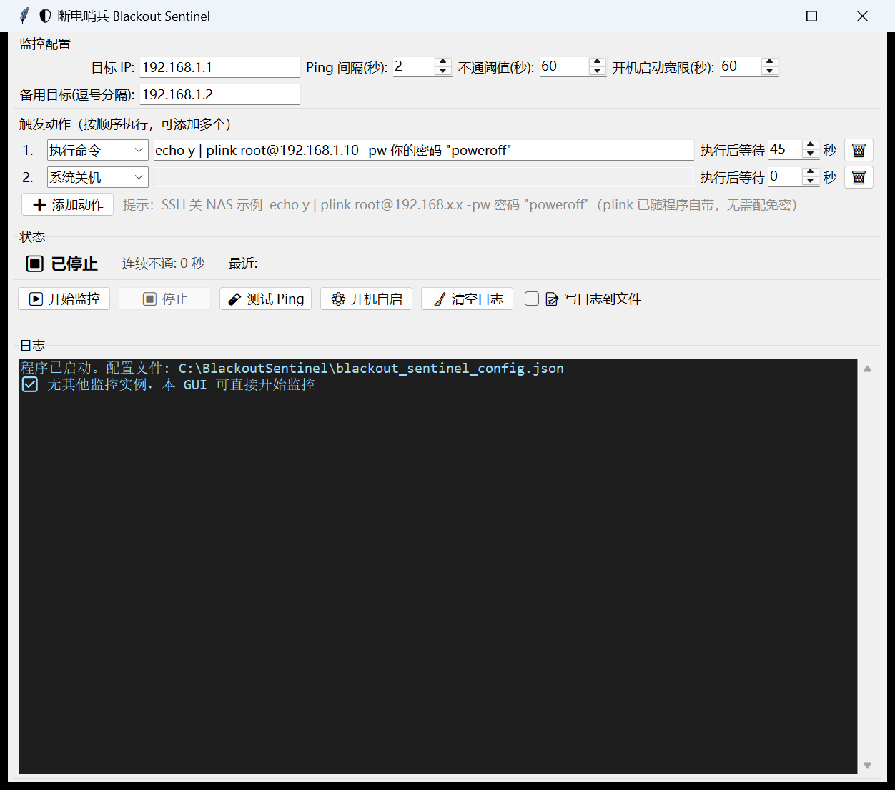

<div align="center">

# 🛡️ 断电哨兵 Blackout Sentinel

### UPS 没有通讯口？让一台不接 UPS 的路由器当「停电探针」——断电瞬间，自动优雅关机。

</div>



<div align="center">

持续 ping 局域网里一台**不接 UPS** 的设备（路由器 / AP / 交换机 / 光猫）。
它在线 = 市电正常；它消失 = 市电断了 → 趁 UPS 还有电，自动按动作链关机：先 SSH 关 NAS、等几十秒、再关本机。

</div>

---

## 🎯 解决什么问题

NAS / 服务器 / 工作站接了 UPS，但 UPS **没有 USB / 网卡通讯口**（或监控软件不好用），系统根本不知道现在是市电还是电池。

电池一耗尽就是**硬断电**——丢数据、坏文件系统、RAID 降级。

**断电哨兵不需要任何通讯协议**：只要局域网里有台路由器，就能判断断电。

> 💡 路由器、AP、光猫这类嵌入式设备断电无碍，天生适合当探针；PC / NAS 怕断电才需要 UPS，不适合当探针。

```
                       市电 (AC)
                         │
             ┌───────────┴────────────┐
             │                        │
           UPS                     不接 UPS
             │                        │
      ┌──────┴──────┐            探针设备
      │             │          AP / 路由器 /
   NAS / 服务器     本机        交换机 / 光猫
   (装 Blackout Sentinel)      （嵌入式，不怕断电）
      │             │                 │
      └──────┬──────┘                 │
             │   同一局域网            │
             └────────────────────────┘
                     ↑
           哨兵持续 ping 探针
      探针在线 = 市电正常
      探针消失 = 市电断电 → UPS 电池倒计时 → 触发动作链优雅关机
```

---

## ⚡ 核心特性

| | 特性 | 说明 |
|---|---|---|
| 🔌 | **零硬件依赖** | 不需要 UPS 通讯口、不需要网卡管理协议，能 ping 通路由器就能用 |
| 🎯 | **多探针仲裁** | 主目标 + 最多 2 个备用目标，**全部不通才算断电**——单台路由器重启 / 固件抖动不会误关机 |
| 🛡️ | **开机启动宽限** | 开机后默认 60 秒保护期（DHCP / 交换机 STP / 网卡驱动未就绪），期内绝不触发，杜绝「开机就把自己关了、关机后永不起机」 |
| ⛓️ | **动作链** | 触发后按顺序执行最多 10 个动作：执行命令（SSH 关 NAS）→ 等待 → 系统关机 / 休眠 / 打开软件 |
| 🔁 | **关机失败重试到死** | 关机命令失败？只要网络仍不通，每 60 秒自动重试整条动作链，绝不「躺平」 |
| 🧱 | **5 种开机自启** | Windows 服务（SYSTEM，推荐）/ 开机计划任务 / 登录任务 / 注册表 / 启动文件夹，可叠加冗余部署 |
| 🔥 | **崩溃自愈** | 引擎线程独立托管 + 服务 `sc failure` 重启×6 + 计划任务兜底，为 7×24 无人值守设计 |
| 🧾 | **配置热加载** | GUI 改完配置 2 秒内自动生效，不用停监控；非法配置直接忽略，配置损坏自动从 `.bak` 恢复 |
| 🔒 | **单实例互斥** | `Global\` 互斥体（NULL DACL，跨 session 0），服务与 GUI 永不重复监控 |
| 🫥 | **密码脱敏** | 日志与界面中 `plink -pw 密码` 自动显示为 `-pw ****` |

---

## 🚀 快速开始

1. 下载 Release 中的 **`BlackoutSentinel.exe`**（单文件，plink 已内置，无需安装 Python）
2. 双击打开图形界面
3. 填写「监控配置」：
   - **目标 IP**：一台**不接 UPS** 的探针设备 IP（路由器 / AP / 交换机 / 光猫）。⚠️ 不要填 UPS 保护的设备（如另一台 NAS）——断电时它们还在线，判断不了断电
   - **不通阈值(秒)**：默认 60，建议 60~120——连续不通这么久才判定断电，容忍探针重启的短暂离线
   - **开机启动宽限(秒)**：默认 60
   - **备用目标**：建议再填 1~2 个**同样不接 UPS** 的探针 IP（逗号分隔），多重保险
4. 在「触发动作」区配置动作链（默认就是「系统关机」，开箱即用）
5. 点 **「▶ 开始监控」**
6. 点 **「⚙️ 开机自启」** 安装 Windows 服务（推荐），实现断电无人值守

所有参数自动保存到程序同目录 `blackout_sentinel_config.json`，换机直接拷贝即可。

---

## 📋 典型场景：断电后先关 NAS 再关本机

动作链配两行（点 ➕ 添加动作）：

| # | 动作 | 内容 | 执行后等待 |
|---|---|---|---|
| 1 | **执行命令** | `echo y \| plink root@192.168.x.x -pw 你的密码 "poweroff"` | **45~60 秒** |
| 2 | **系统关机** | （无需填写） | 0 |

- `plink.exe`（PuTTY 命令行 SSH）已随程序自带，命令里直接写 `plink` 即可，程序目录已自动加入 PATH
- `echo y |` 用于首次连接自动确认主机密钥，无需提前配免密
- 「执行后等待」给 NAS 留足停服务、卸硬盘、断电的时间，然后本机才关机
- 单个动作失败不中断后续动作——NAS 关不上，本机照样关

> ⚠️ 密码明文保存在配置文件中，请注意机器物理访问安全。

---

## 🎛️ 参数说明

**监控配置区**

| 参数 | 默认 | 范围 | 说明 |
|---|---|---|---|
| 目标 IP | — | 合法 IPv4 | 不接 UPS 的探针设备 IP |
| Ping 间隔(秒) | 2 | 1~60 | 多久 ping 一次探针 |
| 不通阈值(秒) | 60 | 5~3600 | 连续不通多久判定断电 |
| 开机启动宽限(秒) | 60 | 0~3600 | 开机后网络未就绪的保护期，期内即使连续不通也不触发；`0` = 关闭 |
| 备用目标 | 空 | 最多 2 个 | 所有目标**全部不通**才算断电，任一通则正常 |

**动作链区（每行一个动作，按顺序执行）**

| 动作类型 | 目标内容 | 说明 |
|---|---|---|
| 执行命令 | 命令行文本 | 同步执行并等待真实返回码（如 plink 关 NAS）；支持管道 |
| 系统关机 | 无需填写 | `shutdown /s /f /t 0`，失败自动降级系统 API 强制关机 |
| 系统休眠 | 无需填写 | `shutdown /h /f`，失败自动降级 SetSuspendState |
| 打开软件 | 程序路径 | 启动指定程序 / 文件 |

每行的 **「执行后等待 N 秒」** = 该动作完成后、下一动作开始前的等待时间（0~600 秒），最后一行无需填写；等待期间点「停止」可打断。

---

## 🔧 后台运行与开机自启

点「⚙️ 开机自启」管理，支持 5 种冗余部署方式（可多选）：

> **所有自启方式启动后都会自动进入监控**（`--background` 后台模式），无需人工干预。
> 双击打开 GUI 时会自动提权为管理员运行（UAC 自动接受时静默无感），自启安装一步到位。

| 方式 | 身份 | 说明 |
|---|---|---|
| **Windows 服务（service）** | SYSTEM | 开机即启动，无需登录，崩溃自动重启×6（24h 重置计数），**推荐** |
| 开机计划任务（boot-task） | SYSTEM | 开机后台运行，XML 策略：失败重启×3、错过补跑、电池供电也运行 |
| 登录计划任务（logon-task） | 当前用户 | 登录后自动后台监控 |
| 注册表 Run（reg-run） | 当前用户 | 登录后自动后台监控 |
| 启动文件夹快捷方式（startup-lnk） | 当前用户 | 登录后自动后台监控 |

- 服务 / 后台模式**无窗口运行**，配置文件热加载
- 若后台监控已在运行，打开 GUI 会自动进入「配置面板模式」——只改配置，不重复监控
- 双击运行即自动提权为管理员；若提权失败（UAC 设置异常），需管理员方式操作时界面会明确提示右键「以管理员身份运行」

命令行：

```bash
BlackoutSentinel.exe                    # 启动 GUI（自动提权为管理员）
BlackoutSentinel.exe --background       # 后台监控（无窗口，不提权）
BlackoutSentinel.exe --install all      # 安装全部自启（server/desktop/all/单个方式名，自动提权）
BlackoutSentinel.exe --uninstall all    # 卸载自启
BlackoutSentinel.exe --status           # 查看各自启方式状态
```

---

## 🧱 可靠性设计

**关机一定关得掉：**

1. 执行前自动启用进程 `SeShutdownPrivilege` 关机权限
2. **同步**执行 `shutdown.exe` 并检查返回码、捕获错误输出（rc=1190 已有计划关机也视为成功）
3. 失败自动降级到系统 API（ExitWindowsEx / SetSuspendState）直接关机 / 休眠
4. 真实结果如实写日志；彻底失败时提示检查账户权限 / 组策略 / 杀软拦截
5. **绝不放弃**：网络仍不通时每 60 秒重试整条动作链（关机命令幂等，重复执行安全）

**7×24 不翻车：**

- 引擎在服务进程内由独立线程托管，线程意外死亡自动重启（连续 3 次失败则进程退出，由 SCM 60 秒后重启整个服务）
- `--background` 后台进程内置 supervisor 循环，引擎崩溃 5 秒后自动重启，连续 10 次降级为 60 秒间隔
- 热加载先做完整合法性校验（IP 格式、数值范围、动作链），非法配置直接忽略并告警，继续使用上一份有效配置
- 配置文件损坏 / 缺失自动从 `.bak` 备份恢复（每次保存自动备份上一份）
- 系统休眠 / 挂起导致时间跳变时，本轮 ping 结果作废、计时重置
- ping 判据严格：以返回 `TTL=` 为准，同网段「无法访问目标主机」（退出码为 0 的假通）判为不通
- 服务响应 SCM SHUTDOWN 控制，系统正常关机 / 重启时立即停止引擎，绝不阻拦

**日志：**

- 默认不写本地日志文件（界面日志框照常显示）；勾选「📝 写日志到文件」后才写入 `blackout_sentinel_service.log`，自动轮转（超过 2MB 保留最近 2000 行）
- DPI 自适应，高缩放下字体不发虚

---

## 📁 文件说明

| 文件 | 作用 |
|---|---|
| `BlackoutSentinel.exe` | 主程序（单文件打包，内含 plink） |
| `plink.exe` | PuTTY 命令行 SSH（已打包进 exe，放同目录做双保险） |
| `blackout_sentinel_config.json` | 运行配置（自动生成，换机可直接拷贝） |
| `blackout_sentinel_service.log` | 运行日志（**默认不生成**，勾选文件日志后才写入） |

---

## 🧑‍💻 源码结构

| 文件 | 说明 |
|---|---|
| `main.py` | 统一入口（GUI / `--background` / `--service-run` / 安装卸载） |
| `blackout_sentinel.py` | Tkinter GUI（动作链编辑、配置面板、自启管理窗口） |
| `sentinel_core.py` | 核心引擎：配置持久化、ping、动作链执行、单实例、热加载 |
| `sentinel_autostart.py` | 5 种自启方式安装 / 卸载 + Windows 服务宿主 |
| `test_smoke.py` | 冒烟测试（42 项：配置读写容错、动作链、热加载、互斥、ping） |
| `BlackoutSentinel.spec` | PyInstaller 打包配置 |

```bash
python -m PyInstaller BlackoutSentinel.spec --noconfirm   # 打包
python test_smoke.py                                      # 冒烟测试
```
